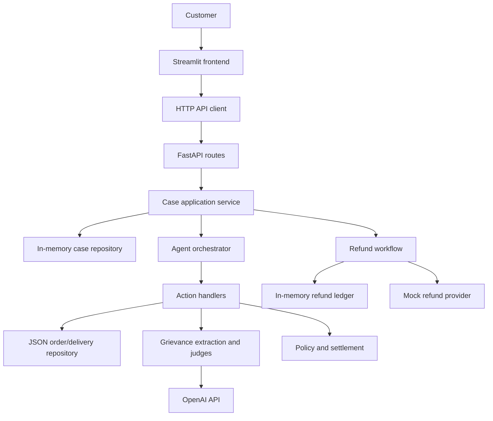

# RefundBench

RefundBench is a customer-support refund-resolution application. It provides
a Streamlit interface and a FastAPI backend for resolving customer complaints
using order and delivery data, LLM-assisted grievance evaluation, and
deterministic policy and settlement logic.

## What it does

For a submitted customer complaint, RefundBench follows this workflow:

1. Retrieve the order and delivery.
2. Extract grievances from the complaint.
3. Build evidence for each grievance and evaluate it with parallel judges.
4. Reach consensus, apply refund policy, and calculate a settlement.
5. Let the customer accept an approved refund through the interface.

Refund acceptance uses an order-based idempotency key in the current refund
workflow. Cases and refund records are currently held in process-local memory;
order and delivery data are read from JSON files in `data/`.

## Architecture



## Project structure

```text
.
├── app/
│   ├── agent/                 # Agent state, workflow, harness, action handlers
│   ├── application/cases/     # Case use cases and in-memory case repository
│   ├── domain/                # Order, delivery, grievance, and evidence models
│   ├── evaluation/            # Evidence, grievance extraction, judges, consensus
│   ├── infrastructure/        # LLM, JSON order access, observability
│   ├── interfaces/api/        # FastAPI routes, schemas, and mappers
│   ├── policy/                # Refund policy decisions
│   ├── response/              # Customer response generation
│   ├── settlement/            # Settlement and refund lifecycle
│   └── bootstrap.py           # Dependency wiring and API app factory
├── config/                    # Environment settings and logging setup
├── data/                      # JSON orders, deliveries, and agent test cases
├── frontend/                  # Streamlit UI and HTTP API client
├── tests/                     # Pytest suite
├── app.py                     # Streamlit entry point
├── backend.py                 # FastAPI ASGI entry point
└── requirements.txt
```

## Run locally

Create and activate a virtual environment, then install dependencies:

```bash
python3 -m venv .venv
source .venv/bin/activate
pip install -r requirements.txt
```

Configure the required OpenAI settings in the environment or a root `.env`
file:

```dotenv
OPENAI_API_KEY=your_api_key
OPEN_AI_MODEL=your_model_name
```

Start the FastAPI backend:

```bash
uvicorn backend:app --host 127.0.0.1 --port 8000
```

In a second terminal, activate the environment and start the Streamlit
frontend:

```bash
streamlit run app.py
```

The frontend uses `http://localhost:8000` by default. Set `BACKEND_URL` to
override the backend URL.

## Run tests

With the virtual environment active:

```bash
pytest
```

## Current focus

The next phase is evaluating the refund agent’s quality, performance, and
business impact.
